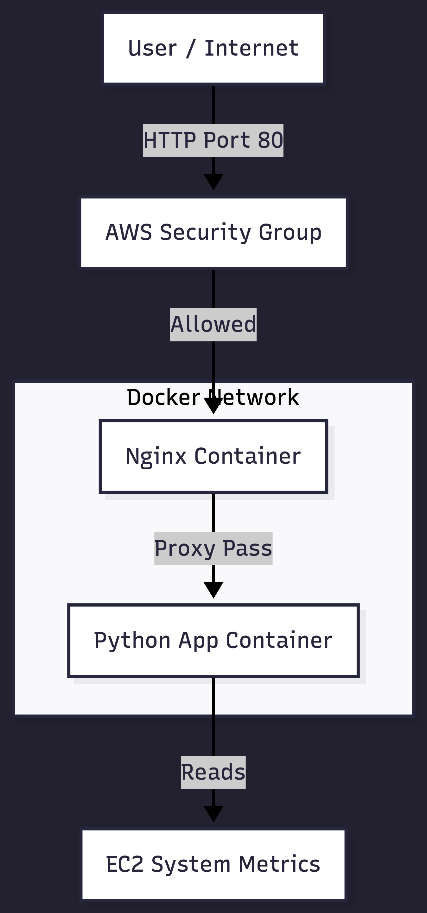
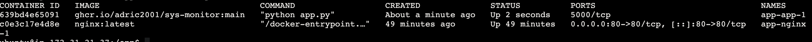

# ☁️ Cloud-Native System Monitor

## 📖 Project Overview
This project is a full-stack DevOps demonstration that monitors real-time system resources (CPU, Memory, Disk). Unlike a traditional script, this application is **containerized**, **automatically built** via CI/CD, and **deployed** to AWS using Infrastructure as Code (IaC).

It bridges the gap between System Administration and modern Cloud Engineering by treating infrastructure as flexible software. The application is securely hidden behind an **Nginx Reverse Proxy** and deployed to AWS automatically via Terraform.

## 🏗 Architecture
The project follows a modern "Immutable Infrastructure" approach using the **Sidecar Pattern**:

1.  **Code:** Python Flask application queries kernel-level metrics.
2.  **Containerization:** Docker packages the app and dependencies into a portable image.
3.  **Orchestration:** Nginx handles external traffic (Port 80) and routes it to the Python application on a private Docker network.
4.  **CI/CD:** GitHub Actions automatically builds the image (Multi-Arch for AMD64/ARM64) and pushes it to the GitHub Container Registry (GHCR).
5.  **Infrastructure:** Terraform provisions a free-tier AWS EC2 instance (t2.micro), configures Security Groups, and bootstraps the server.

## 🛠 Tech Stack
* **Orchestration:** Docker Compose & Nginx
* **Infrastructure:** Terraform (AWS EC2, VPC, Security Groups)
* **CI/CD:** GitHub Actions (Multi-Arch Builds for AMD64/ARM64)
* **App:** Python 3.9, Flask, psutil

## 🐳 Orchestration Proof
The screenshot below confirms that two containers are running. Note that the Python App (sys-monitor) does not expose ports to the host (0.0.0.0), ensuring it is only accessible via Nginx.

## 🚀 How to Deploy
### Option 1: Run Locally (Docker Compose)
You can run the full production stack on your local machine.

**1. Clone the repo:**
git clone [https://github.com/adric2001/sys-monitor.git](https://github.com/adric2001/sys-monitor.git)
cd sys-monitor

**2. Start the stack:**
docker compose up -d

Visit http://localhost (No port needed).

### Option 2: Deploy to AWS (Terraform)
This automates the provisioning of the EC2 instance, installs Docker/Compose, and launches the stack.

Prerequisites:
AWS CLI configured
Terraform installed

**1. Initialize Terraform:**
terraform init

**2. Plan and Apply:**
terraform apply -auto-approve

Output: Terraform will output the public IP of the server. server_ip = "http://54.123.45.67"

Link to EC2 Instance (If Up): http://52.90.149.143/

